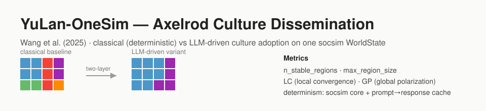

<p align="center"></p>

**English** | [日本語](README.ja.md)

# YuLan-OneSim — Axelrod Culture Dissemination (Wang et al. 2025)

A reimplementation of **one concrete scenario** from YuLan-OneSim (Wang, Gao, Bo, Chen & Wen, 2025; arXiv:2505.07581; NeurIPS 2025 Workshop SEA): the **Axelrod (1997) culture-dissemination** experiment validated quantitatively in the paper's Appendix F. YuLan-OneSim as a whole is a next-generation LLM social simulator (no-code scenario construction, 50 built-in scenarios, self-evolution, up to 100k agents, an AI social researcher); reproducing all of that is out of scope. Instead this repository extends the sibling [`axelrod1997`](../axelrod1997) replication to compare, on **the same socsim `WorldState`**, a **classical deterministic baseline** against an **LLM-driven culture-adoption variant**.

Each grid site holds a culture vector of `F` features, each feature a trait value in `0..q`. The model is event-driven: one engine tick is `events_per_step` micro-events (default = number of sites). Per event a site `s` and a random Von Neumann neighbour `nb` are drawn; similarity `sim = matching_features / F` is computed; and with probability `sim` one differing feature is adopted from `nb`. The absorbing state is reached when every adjacent pair has `sim ∈ {0, 1}`. Axelrod's headline result — local interaction drives *local convergence* yet preserves *global polarization* — emerges from this rule.

Two **mutually exclusive** interaction mechanisms are selected by `--provider`:

- `--provider none` → `ClassicalInteractionMechanism`: the deterministic Axelrod baseline (no LLM). **This is the default** and the path that reproduces Axelrod's Table 7-2 numbers.
- `--provider ollama|openai` → `LLMInteractionMechanism`: the YuLan-OneSim variant, where an LLM decides whether / which feature to adopt given the site's persona, its own culture vector and the neighbour's.

## Two-layer determinism (read this first)

LLM output is **outside** socsim's bit-reproducibility, so the design splits into two layers:

- **Deterministic socsim core** — culture initialisation, site/neighbour sampling (`ctx.rng`, ChaCha20), scheduling, metrics and convergence. Given a seed this reproduces bit-for-bit. The classical provider lives entirely here and makes **zero LLM calls**.
- **Non-deterministic LLM layer** — the adoption decision. Pseudo-determinised by `socsim-llm`'s `CachingClient` (a `hash(prompt+model)` → response cache), `temperature=0` and a fixed seed. The provider order is **Ollama first → OpenAI fallback** via `socsim-llm`'s `FallbackClient`.

The cache — not the model — is the reproducibility mechanism: a warm cache replays identical responses. Each run writes `run_metadata.json` recording provider / model / endpoint / temperature / seed / cache-hit rate. Because the local default model (`llama3.2`) differs from the paper, LLM reproduction targets are **qualitative** (same monoculture↔polyculture transition); the **classical** path is reproduced **quantitatively**.

## Install & Quick start

```bash
# Build the Rust simulation (fetches socsim incl. socsim-llm with Ollama+OpenAI backends)
cargo build --release

# === Classical (no LLM) baseline — reproduces Axelrod Table 7-2 ===
cargo run --release -- run --provider none --width 10 --height 10 --features 5 --traits 10 --runs 30 --seed 42

# === LLM variant (Ollama first) — small grid ===
#   ollama pull llama3.2:latest
export OLLAMA_HOST=http://localhost:11434
export OLLAMA_MODEL=llama3.2:latest
cargo run --release -- run --provider ollama --width 5 --height 2 --features 5 --traits 5 --rounds 100 --seed 42

# === Sensitivity sweep (classical F×q) ===
cargo run --release -- sweep --provider none \
    --features-min 5 --features-max 15 --features-step 5 \
    --traits-min   5 --traits-max   15 --traits-step   5 \
    --runs 30 --seed 42

# === Appendix F / Table 7-2 batch reproduction (classical, offline) ===
cargo run --release -- reproduce --runs 30 --seed 42        # observed-vs-paper LC/GP + PASS/off

# === Classical vs LLM quantitative comparison (offline mock LLM) ===
cargo run --release -- compare --mock --features 5 --traits 5 --rounds 100 --seed 42

# Python visualization tools (at the workspace root)
uv sync
uv run culture-llm-tools visualize                 # culture map + LC/GP time series
uv run culture-llm-tools visualize-sweep           # F×q heatmaps
uv run culture-llm-tools show-experiment-settings  # config / sweep_config / run_metadata
uv run culture-llm-tools reproduce                 # Table 7-2 observed-vs-paper figures
uv run culture-llm-tools animate                   # intermediate culture-map animation / montage
uv run culture-llm-tools behavior-graph            # behaviour-graph / ODD concept diagram
uv run culture-llm-tools compare-report            # classical-vs-LLM comparison figure
```

An offline (LLM-free) smoke of the LLM **pipeline** is available via a scripted mock client:

```bash
cargo run --release --example mock_smoke -- results
```

## Documentation

- [Architecture](docs/architecture.md) — world state, mechanisms, two-layer determinism, snapshots, the behaviour-graph / ODD concept export, the GP inconsistency note
- [CLI reference](docs/cli.md) — `run` / `sweep` / `reproduce` / `compare` flags
- [Reproduction](docs/reproduction.md) — Axelrod Table 7-2 numbers, Appendix F LC/GP, the `reproduce` / `compare` harnesses
- [Visualization](docs/visualization.md) — the Python tools and their outputs (incl. `animate`, `behavior-graph`, `compare-report`)

## References

- Wang, L., Gao, H., Bo, X., Chen, X., & Wen, J.-R. (2025). *YuLan-OneSim: Towards the Next Generation of Social Simulator with Large Language Models.* arXiv:2505.07581.
- Axelrod, R. (1997). *The Dissemination of Culture: A Model with Local Convergence and Global Polarization.* Journal of Conflict Resolution, 41(2), 203–226.
- Simulation engine: [socsim (rs-social-simulation-tools)](https://github.com/akitenkrad/rs-social-simulation-tools).

## License

MIT — see [LICENSE](LICENSE).

---
*This file was generated by Claude Code.*
